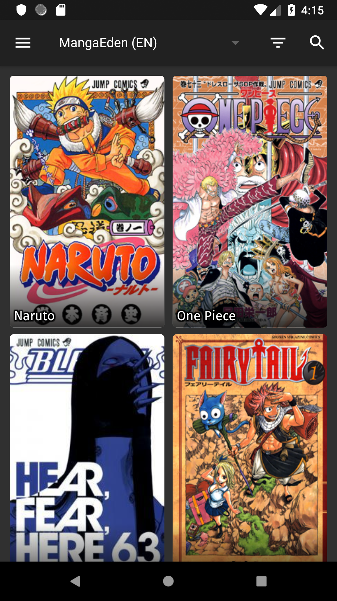
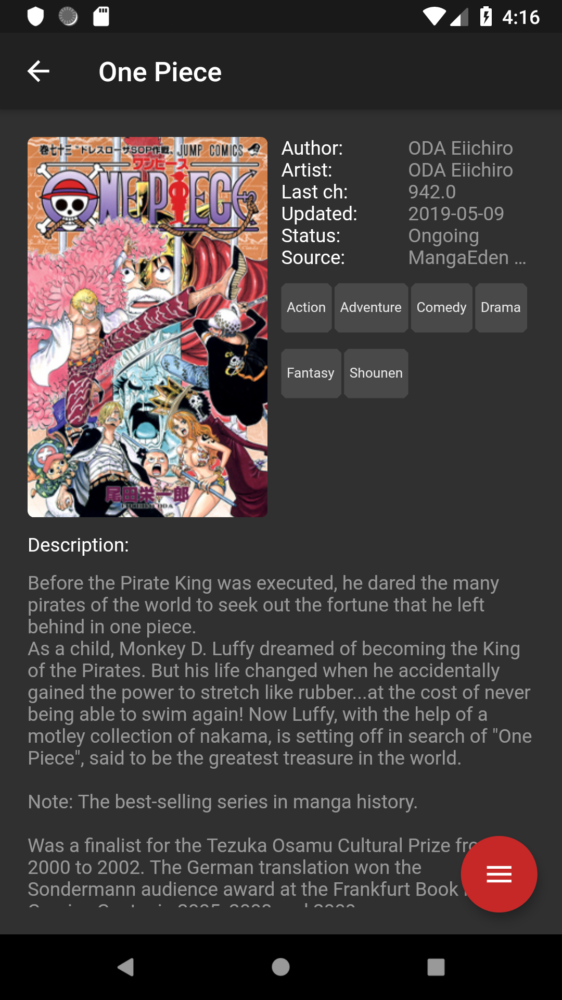
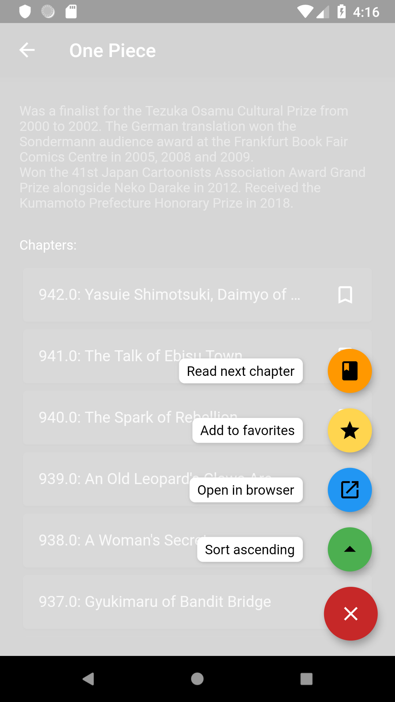

# Dokusho

A Flutter application for reading manga

This application works on both iOS and Android.

With some tinkering, it should work on desktop/web as well.

## Screenshots

  
  
  
  

## Supported sources
- MangaEden (EN)
- MangaEden (IT)

## Todo
- Add download/offline support
- Add more sources

PRs are welcome for adding more sources to this application.
